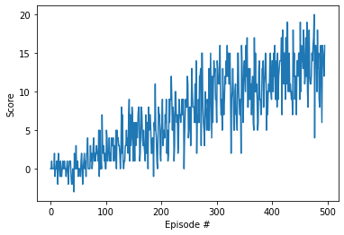

### Introduction

The goal of this project was to train a reinforcement learning (RL) agent to navigate a field of bananas. The agent was to collect yellow bananas while avoiding blue ones. The environment was rendered using the Unity ML environment and the models were built using Pytorch. The project trains a Deep Q-Network (DQN) agent to solve the environment.

A DQN is an RL architecture that can map a continuous state space to a discrete action space. It is an improvement over a Q-Learning algorithm because it uses a deep neural network to approximate the action value function rather than directly trying to estimate it (using a Q-table, for example), which is either difficult or impossible for a continuous state space.

#### Environment Background

The simulation contains a single agent that navigates a large environment.  At each time step, it has four actions at its disposal:
- `0` - walk forward 
- `1` - walk backward
- `2` - turn left
- `3` - turn right

The state space has `37` dimensions and contains the agent's velocity, along with ray-based perception of objects around agent's forward direction.  A reward of `+1` is provided for collecting a yellow banana, and a reward of `-1` is provided for collecting a blue banana. 

The task is episodic and considered solved when the agent gets an average score of +13 over 100 consecutive episodes. 

### Model Specifications and Training Details

To solve the environment, this agent was trained using a Deep Q Network (DQN). This DQN has two modifications to a vanilla DQN, namely an experience replay buffer and a soft fixed target update rule. The experience replay buffer holds 100000 samples total, and samples experiences in batch sizes of 64. The soft fixed target update rule updates both the target network weights and the local network weights every four steps using $\theta_{target} = \tau \theta_{local} + (1 - \tau) \theta_{target}$ where $\theta$ is the network weights and $\tau$ is a value between 0 and 1. The implementation uses an $\epsilon$-greedy policy to select the actions and a greedy policy to evaluate the next action. The $\epsilon$-greedy policy uses epsilon decay to encourage exploration in the beginning and exploitation towards the end.

Both the target network and the local network have two hidden layers, each with 64 nodes. The hidden layers use a relu activation function and the output layer uses a linear activation function. The input layer is the same size as the state space and the output layer is the size of the action space (37 and 4, respectively for the banana collection environment).

In the case of the Dueling DQN, the hidden layers have the same amount of nodes and use the same activation functions for the hidden and output layers as the vanilla DQN. However, the Dueling DQN splits into two streams at the second hidden layers and the output layers. In this case, the splits also have 64 nodes at each hidden layer, but the output layer for the value stream has one node while the number of output nodes for the advantage stream is determined by the action space (4 in this case). The Dueling DQN combines the streams into a single output using this function:

$$Q(s, a | \theta, \alpha, \beta) = V(s | \theta, \beta) + (A(s, a | \theta, \alpha) - \frac{1}{|A|} \sum_{a' \in |A|}{A(s, a' | \theta, \alpha)})$$

where $Q(.)$ is the action-value function, $V(.)$ is the state-value function, $A(.)$ is the advantage function, $s, a$ is the state-action pair, $a'$ is advantageous action, $|A|$ is the set of actions, $\theta$ is the neural network parameters for the main layers, and $\alpha$ and $\beta$ are the parameters for the two streams.

#### Hyperparameters and Default Values

The DQN agent initializes the following hyperparameters:

```
BUFFER_SIZE = int(1e5)  # replay buffer size
BATCH_SIZE = 64  # minibatch size
GAMMA = 0.99  # discount factor
TAU = 1e-3  # for soft update of target parameters
LR = 5e-4  # learning rate
UPDATE_EVERY = 4  # how often to update the network
```

and the dqn training loop function initializes these hyperparameters:

```{python}
n_episodes = 2000 # maximum number of training episodes
max_t = 1000 # maximum number of timesteps per episode
eps_start = 1.0 # starting value of epsilon, for epsilon-greedy action selection
eps_end = 0.01 # minimum value of epsilon
eps_decay = 0.995 # multiplicative factor (per episode) for decreasing epsilon
target_score = 13 # the score to stop evaluating at
```

### Results

This agent was able to solve the environment in 396 episodes. A plot of the average rewards over time is shown below:



### Ideas for future work

While this DQN implementation solves this environment fairly well, there are still many areas for improvement. Future work could consider incorporating multi-step bootstrap targets or prioritized experience replay. The DQN could also be modified to include a Distributional DQN or a Noisy DQN. All of those methods could be combined, an example being the Rainbow algorithm. This example ws solved using trial and error by the author, but hyperparamter tuning both the networks and the RL algorithm as a whole could lead to better results.