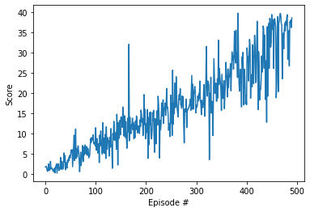

### Introduction

The goal of this project was to train a reinforcement learning (RL) agent to move a double-jointed arm to target locations. The target location moves in a circular fashion, and the arm needs to adjust to match the target location. The environment was rendered using the Unity ML environment and the models were built using Pytorch. The project trains a Twin Delayed Deep Deterministic Policy Gradient (TD3) agent to solve the environment.

TD3 is an RL architecture that can map a continuous state space to a continuous action space. It is an improvement over the DDPG algorithm (DDPG being the generalization of Deep Q-netowrk for continuous action spaces) because it uses two critic networks instead of one, and it delays the update of the policy (actor network).

This project first attempted to use DDPG to train the environment, but the DDPG implementation the author used as shown to be difficult to train and very unstable. After replacing the DDPG with TD3, results improved significantly.

#### Environment Background

In this environment, a double-jointed arm can move to target locations. A reward of +0.1 is provided for each step that the agent's hand is in the goal location. Thus, the goal of your agent is to maintain its position at the target location for as many time steps as possible.

The observation space consists of 33 variables corresponding to position, rotation, velocity, and angular velocities of the arm. Each action is a vector with four numbers, corresponding to torque applicable to two joints. Every entry in the action vector should be a number between -1 and 1.

The task is episodic and considered solved when the agent gets an average score of +30 over 100 consecutive episodes.

### Model Specifications and Training Details

To solve the environment, this agent was trained using TD3. This TD3 agent utilizes an experience replay buffer and a soft fixed target update rule. The experience replay buffer holds 100000 samples total, and samples experiences in batch sizes of 128. The soft fixed target update rule updates both the target network weights and the local network weights of th critics every step using $\theta_{target} = \tau \theta_{local} + (1 - \tau) \theta_{target}$ where $\theta$ is the network weights and $\tau$ is a value between 0 and 1. 

TD3 has an advantage over DDPG because the learning is much more stable. DDPG has a tendency to overestimate the action values because the TD error compounds in the critic network update. To reduce overestimation of the action values, TD3 makes three main improvements. First, it delays the update to the policy (actor) network. Instead, the policy network is updated every two steps. Second, the implementation uses two critic networks to improve stability. The algorithm maintains two separate critic networks that estimate the action-value function. During the target value calculation, the minimum action value between the two critics is picked. Third, clipped noise is added to the next actions in the critic update step. The noise acts as a type of regularization on the actions.

The actor network has two hidden layers, the first with 64 nodes and the second with 32 nodes. The hidden layers use a relu activation function and the output layer uses a tanh activation function (to restrict the actions between -1 and 1). The input layer is the same size as the state space and the output layer is the size of the action space (33 and 4, respectively for the reacher environment).

The two critic networks are identical and each have two streams, one for the action space and one for the state space. The activation function for all the hidden layers in both streams is ReLU. The action stream has one hidden layer with 32 nodes. The state input stream has two layers, the first with 64 nodes and the second with 128 nodes. The following hidden layer concatenates the two streams together as input and has 128 nodes. That layer is followed by one more hidden layer with 64 nodes. The output layer uses a linear activation.

#### Hyperparameters and Default Values

The TD3 agent initializes the following hyperparameters:

```
BUFFER_SIZE = int(1e5)  # replay buffer size
BATCH_SIZE = 128  # minibatch size
GAMMA = 0.99  # discount factor
TAU = 5e-3  # for soft update of target parameters
LR_ACTOR = 1e-3  # learning rate
LR_CRITIC_1 = 1e-3  # learning rate
LR_CRITIC_2 = 1e-3  # learning rate
UPDATE_EVERY = 1  # how often the agent should learn
POLICY_UPDATE_FREQUENCY = 2  # How often to update the policy
```

and the TD3 training loop function initializes these hyperparameters:

```{python}
n_episodes = 2000 # maximum number of training episodes
max_t = 1000 # maximum number of timesteps per episode
target_score = 30 # the score to stop evaluating at
```

### Results

This agent was able to solve the environment in 391 episodes. A plot of the average rewards over time is shown below:



The 

### Ideas for future work

While this TD3 implementation solves this environment fairly well, there are still many areas for improvement. Future work could consider incorporating gradient clipping or more sophisticated noise functions such as OU noise or adaptive parameter noise. This implementation of TD3, while effective at solving the problem, takes a significant amount of run time and is not as computationally efficient. If parallel methods such as A3C could be adapted to TD3, it might improve the computational efficiency and make it more practical. Another way to improve performance might be to try other algorithms, such as SAC. This example was solved using trial and error by the author, but hyperparamter tuning all the networks and the RL algorithm as a whole could lead to better results.