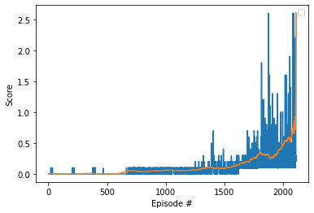

### Introduction

The goal of this project was to train two reinforcement learning (RL) agents to play tennis against each other. The goal of the players is to keep the ball from falling, as well as keep the ball in play for as long as possible. The environment was rendered using the Unity ML environment and the models were built using Pytorch. The project trains a Multi Agent Twin Delayed Deep Deterministic Policy Gradient (MATD3) agent to solve the environment.

TD3 is an RL architecture that can map a continuous state space to a continuous action space. It is an improvement over the DDPG algorithm (DDPG being the generalization of Deep Q-netowrk for continuous action spaces) because it uses two critic networks instead of one, and it delays the update of the policy (actor network). MATD3 is an extension on TD3 that accounts for multiple agents operating in a single environment.

#### Environment Background

In this environment, two agents control rackets to bounce a ball over a net. If an agent hits the ball over the net, it receives a reward of +0.1. If an agent lets a ball hit the ground or hits the ball out of bounds, it receives a reward of -0.01. Thus, the goal of each agent is to keep the ball in play.

The observation space consists of 8 variables corresponding to the position and velocity of the ball and racket. Each agent receives its own, local observation. Two continuous actions are available, corresponding to movement toward (or away from) the net, and jumping.

The task is episodic, and in order to solve the environment, the agents must get an average score of +0.5 (over 100 consecutive episodes, after taking the maximum over both agents). Specifically,

- After each episode, we add up the rewards that each agent received (without discounting), to get a score for each agent. This yields 2 (potentially different) scores. We then take the maximum of these 2 scores. 
- This yields a single score for each episode.

The environment is considered solved, when the average (over 100 episodes) of those scores is at least +0.5.

### Model Specifications and Training Details

To solve the environment, this agent was trained using MATD3. This MATD3 agent utilizes an experience replay buffer and a soft fixed target update rule. The experience replay buffer holds 100000 samples total, and samples experiences in batch sizes of 256. The soft fixed target update rule updates both the target network weights and the local network weights of the critics every step using $\theta_{target} = \tau \theta_{local} + (1 - \tau) \theta_{target}$ where $\theta$ is the network weights and $\tau$ is a value between 0 and 1. 

TD3 has an advantage over DDPG because the learning is much more stable, and as such, MATD3 has a similar advantage over MADDPG. DDPG has a tendency to overestimate the action values because the TD error compounds in the critic network update. To reduce overestimation of the action values, TD3 makes three main improvements. First, it delays the update to the policy (actor) network. Instead, the policy network is updated every two steps. Second, the implementation uses two critic networks to improve stability. The algorithm maintains two separate critic networks that estimate the action-value function. During the target value calculation, the minimum action value between the two critics is picked. Third, clipped noise is added to the next actions in the critic update step. The noise acts as a type of regularization on the actions.

The actor network has two hidden layers, the first with 84 nodes and the second with 32 nodes. The hidden layers use a ReLU activation function and the output layer uses a tanh activation function (to restrict the actions between -1 and 1). The input layer is the same size as the state space and the output layer is the size of the action space (24 and 2, respectively for the Tennis environment).

The two critic networks are identical and each have two streams, one for the combined action space and one for the combined state space (combined meaning that it includes both agents). The activation function for all the hidden layers in both streams is Leaky ReLU. The action stream has one hidden layer with 32 nodes. The state input stream has two layers, the first with 84 nodes and the second with 256 nodes. The following hidden layer concatenates the two streams together as input and has 400 nodes. That layer is followed by one more hidden layer with 200 nodes. The output layer uses a linear activation and returns a single number.

The main difference between TD3 and MATD3 is that the critic networks for each agent have access to the state information of other agents. In this instance, each critic has its own network with its own weights, but in some implementations, the critic networks are shared between the agents (i.e. all agents use and update the same two critic networks).

#### Hyperparameters and Default Values

The MATD3 agent initializes the following hyperparameters:

```
BUFFER_SIZE = int(1e7)  # replay buffer size
BATCH_SIZE = 256  # minibatch size
GAMMA = 0.99  # discount factor
TAU = 5e-3  # for soft update of target parameters
LR_ACTOR = 1e-4  # learning rate
LR_CRITIC_1 = 1e-4  # learning rate
LR_CRITIC_2 = 1e-4  # learning rate
UPDATE_EVERY = 1  # how often the agent should learn
N_UPDATES = 1  # How many updates to do a each update
POLICY_UPDATE_FREQUENCY = 2  # How often to update the policy
```

and the TD3 training loop function initializes these hyperparameters:

```{python}
n_episodes = 5000 # maximum number of training episodes
max_t = 1000 # maximum number of timesteps per episode
target_score = 0.5 # the score to stop evaluating at
```

### Results

This agent was able to solve the environment in 2010 episodes. A plot of the average rewards over time is shown below:



The agents both seem to have learned that a good strategy is to wave your paddle back and forth quickly, and you're likely to get a hit that will keep the ball in motion. Below is a video capture of the agents playing.


### Ideas for future work

While this MATD3 implementation solves this environment fairly well, there is still much room for improvement. In this instance, the actor and critic networks for each agent are of equal size and use the same set of hyperparameters. It would be interesting to experience with different settings between the two agents, for example, would it be possible to create an agent that is less skilled, or develop agents with different strategies?

Future work could also consider incorporating gradient clipping or more sophisticated noise functions such as OU noise or adaptive parameter noise. This implementation of MATD3 did not take advantage of advanced sampling techniques, for example, prioritized experience replay. Other algorithms were not compared against MATD3 and could show promising results, such MAPPO or MASAC. This example was solved using trial and error by the author, but hyperparamter tuning all the networks and the RL algorithm as a whole could lead to better results.